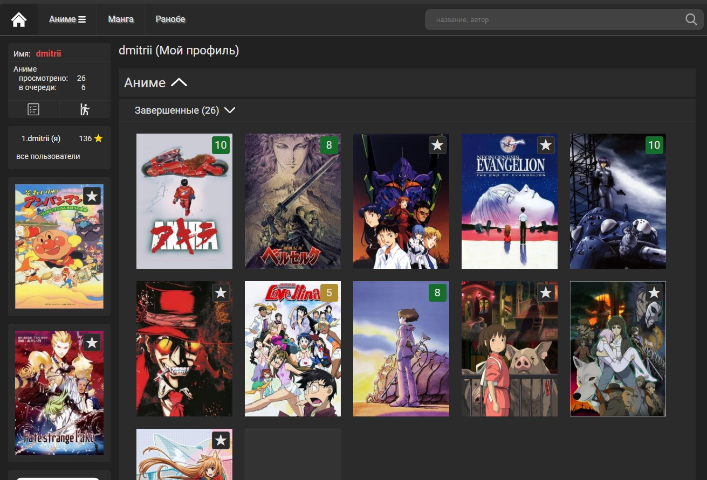
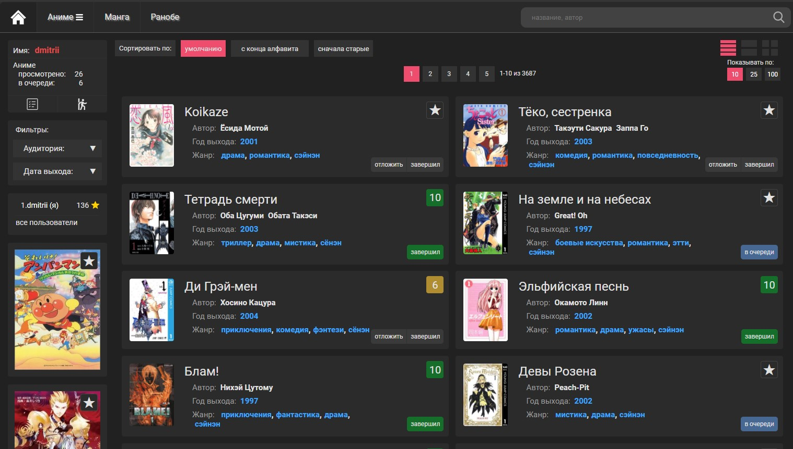
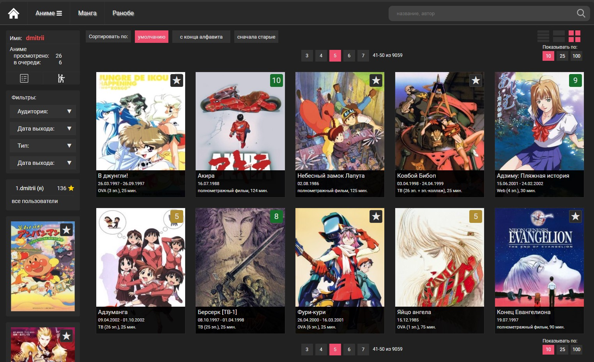
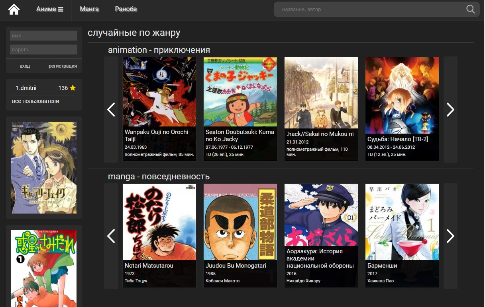
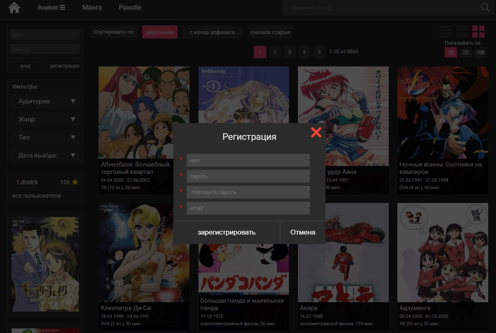

# catalog_books

## Автор
- Miasnikov Dmitrii
- email: miasnikovdmitrii@gmail.com

## Описание
Сайт - каталог аниме, манги, ранобе

## Используемые технологии
- Проект написан на React+Redux с применением Hooks, SCSS, ES6
- Используется База данных MongoDB
- api написано на express лежит в отдельном репозитории https://github.com/DmitriiMiasnikov/catalog_books_api

## Функциональные возможности
- Проект представляет собой каталог Аниме, Манги, Ранобе
- В проекте реализован поиск по названию и автору произведения
- Фильтрация по жанру, году, возрасту, стране
- Сортировка по возрастанию/убыванию года, названия по алфавиту
- Сделана Авторизация и Регистрация пользователя
- Пометка в "завершенное/отложенное" в личный кабинет, оценка произведения по 10 бальной шкале

## Демо
ссылка на проект на хероку:
https://catalog27.herokuapp.com/list/animation/1

## Запуск
```npm run start```

## Скриншоты
[](скриншот)
[](скриншот)
[](скриншот)
[](скриншот)
[](скриншот)
